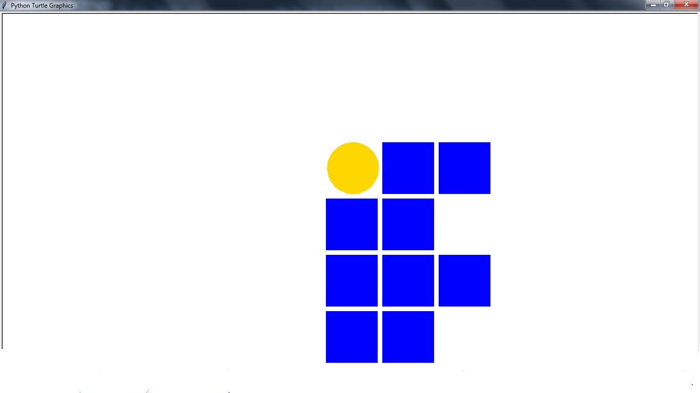

# logo-if

Desenha a logo do Instituto Federal(IF) através do módulo *turtle* da linguagem *Python*.

## Motivação

Eu comecei esse projeto como uma simples brincadeira(será que eu consigo desenhar isso?) assim que eu soube desse módulo de desenho gráfico. "Logo" acabou se tornando um ótimo desafio e eu diria que até uma homenagem pessoal para a instituição onde estudei. Meu maior desafio foi programar o desenho para ser flexível diante alguns tipos de modificação, tais como cores, dimensões das figuras, origem do desenho, etc.

## Estilo de código

Como estou usando python, eu segui orientações do [PEP-8](https://www.python.org/dev/peps/pep-0008/).

## Pré-requisitos

* Python 3.x

## Instalação

Apenas clone o repositório:

`git clone https://github.com/GabrielAlves/logo-if.git`

## Como usar

* Execute o arquivo *logo_if.py* e a logo padrão será automaticamente desenhada. Quaisquer modificações podem ser feitas facilmente alterando as variáveis presentes no construtor da classe *LogoIF*.
* Para alterar as cores, modifique as variáves ***cor_borda_circulo***, ***cor_fundo_circulo***, ***cor_borda_quadrado*** e ***cor_fundo_quadrado***. Você pode encontrar uma paleta com as strings das cores nesse link : https://trinket.io/docs/colors.
* Para alterar as dimensões das figuras, apenas modifique a variável ***comprimento_quadrado***. Todo o resto, do raio do círculo até o espaçamento entre as figuras, é calculado em função dela.
* Para alterar a quantidade de quadrados, modifique os números inseridos nas varíaveis ***numero_quadrados_primeira_pilha***, ***numero_quadrados_segunda_pilha*** e ***numero_quadrados_terceira_pilha***. 
* Para alterar a maneira como os quadrados intercalam, basta alterar as listas ***lista_quadrados_para_pular_da_primeira_pilha***, ***lista_quadrados_para_pular_da_segunda_pilha*** e ***lista_quadrados_para_pular_da_terceira_pilha***.
* Para alterar o local onde o desenho começará a ser desenhado, modifique a variável ***ponto_origem_desenho*** e insira as coordenadas desejadas do plano.
* É possível não desenhar o círculo da logo, apenas setando o booleano ***deve_desenhar_circulo*** para False.

## Screenshots

### A logo padrão desenhada:

### A logo com as dimensões e posições alteradas:

### A logo com a forma alterada:

### A logo com as cores alteradas:

## Créditos

Para fazer o módulo *geometria.py*, eu me baseei no capítulo 4 do livro *Pense Python* de *Allen B. Downey*. 